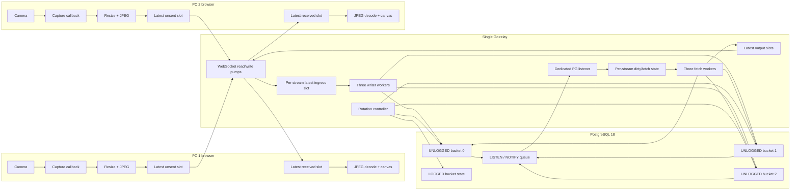

# VidPG V1 Architecture Decision and Implementation Guide

Status: recommended V1 architecture for one to three bidirectional sessions  
Research baseline: PostgreSQL 18, July 2026  
Audience: a developer who knows ordinary programming but is not expected to know video systems, transport protocols, or PostgreSQL internals

## 1. The recommendation in one page

Build one relay process and one PostgreSQL instance. Each browser maintains one full-duplex binary WebSocket to the relay. The browser captures at 640 x 360 and initially targets 10 JPEG frames per second. Every queue in the browser and relay has a capacity of one pending frame: if newer work arrives while older work is still waiting, the older work is replaced.

The relay uses three PostgreSQL writer connections, three fetch connections, one dedicated `LISTEN` connection, and one cleanup connection. It inserts each frame with a prepared, binary-parameterized `INSERT` into one of three standalone `UNLOGGED` bucket tables. The JPEG is stored as `bytea STORAGE EXTERNAL`. A tiny metadata-only notification tells the listener that a stream changed. The listener coalesces notifications, fetches only the newest row from the active and previous buckets, and sends that database result to the destination browser.

Every five seconds, the relay truncates the safely inactive third bucket and then makes it active. Old frames are never removed with a continuous stream of `DELETE` statements.

The chosen path is:

```text
camera
  -> browser frame callback
  -> downscale and JPEG encode
  -> one latest-unsent slot
  -> binary WebSocket
  -> relay validation
  -> one latest-uninserted slot per stream
  -> prepared binary INSERT
  -> PostgreSQL UNLOGGED bucket + TOAST
  -> metadata-only NOTIFY
  -> relay dirty flag
  -> latest-frame SELECT
  -> one latest-unsent output slot
  -> binary WebSocket
  -> JPEG decode
  -> canvas display
```

This architecture is deliberately optimized for **frame freshness**, not delivery completeness. It is also deliberately optimized for a small experiment, not for horizontal scale.

WebSocket remains the V1 transport under one explicit assumption: the clients are on localhost or a reasonably reliable LAN. WebSocket cannot eliminate TCP head-of-line blocking for bytes already written to the connection. If controlled loss tests show that this makes displayed-frame age unacceptable, replace the two media legs with one WebTransport unidirectional stream per frame. Do not begin with WebTransport datagrams because ordinary JPEGs often exceed the permitted datagram size and would require fragmentation, reassembly, deadlines, and whole-frame loss handling before any PostgreSQL work begins.

## 2. What this system is and is not

### 2.1 Objective

The objective is to learn and demonstrate how PostgreSQL behaves when it is placed in the critical path of a continuous stream of disposable binary values.

Success means:

- the receiver displays a recent frame;
- latency does not grow continuously;
- all queues remain bounded;
- PostgreSQL storage remains bounded and periodically returns to a small size;
- every important delay and drop is measurable;
- the byte shown by the receiver was fetched from PostgreSQL.

Success does **not** mean that every captured frame arrives.

### 2.2 V1 operating envelope

The starting envelope is:

| Property | V1 target |
|---|---:|
| Concurrent calls | 1 to 3 |
| Directional streams | 2 to 6 |
| Resolution | 640 x 360 |
| Attempted rate | 10 FPS per direction |
| Normal JPEG size | approximately 20 to 100 KiB; measure the real distribution |
| Application JPEG limit | 150 KiB initially |
| Database hard limit | 1 MiB as a safety boundary |
| Bucket duration | 5 seconds |
| Readable history | active plus previous bucket, approximately 5 to 10 seconds |
| Durability | frame loss after a crash is acceptable |
| Relay placement | same host as PostgreSQL for the first benchmark |
| Client network | localhost or reliable LAN for the WebSocket baseline |

At the upper starting point, six directions x 10 FPS x 100 KiB is about 6 MiB/s of source payload. The bytes cross approximately four major payload legs:

```text
sender -> relay
relay -> PostgreSQL
PostgreSQL -> relay
relay -> receiver
```

That is roughly 24 MiB/s of payload movement before protocol, allocation, TOAST, index, and rendering overhead. This is not a capacity prediction. It is a reminder that the frame bytes move several times.

### 2.3 Non-goals

Do not design V1 for:

- hundreds of calls;
- multiple relay instances;
- PostgreSQL replication;
- historical recording;
- guaranteed frame delivery;
- audio/video synchronization;
- mobile browsers several versions behind;
- Internet-wide NAT traversal;
- Kubernetes, brokers, or service discovery.

Those concerns would distort the first architecture before the actual bottleneck is known.

## 3. Minimum vocabulary

**Frame:** one independently decodable JPEG image.

**Directional stream:** frames moving in one direction. A call between Alice and Bob has two streams: Alice-to-Bob and Bob-to-Alice.

**Sequence number (`seq`):** an integer increased by the sender for every attempted encoded frame. It lets every later stage recognize stale data.

**Freshness:** how old the displayed frame is. This is more important here than the number of frames eventually delivered.

**Backpressure:** what a component does when data arrives faster than it can process. In this system the normal answer is “retain the newest pending frame and discard the older pending frame.”

**Head-of-line blocking:** newer data waits because an older item must finish first. TCP causes this within each direction of a connection when bytes are lost. Application FIFO queues cause it even without packet loss.

**`bytea`:** PostgreSQL's raw binary value type.

**TOAST:** PostgreSQL's mechanism for moving a large column value out of the main table row and storing it as chunks in an associated table.

**WAL:** the write-ahead log used to make ordinary PostgreSQL changes recoverable after a crash.

**UNLOGGED table:** a table whose data changes are not written to ordinary WAL. It is faster for disposable data but is cleared after an unclean shutdown and is not replicated.

**MVCC:** PostgreSQL's concurrency model. An update or delete normally creates obsolete physical tuple versions that later need vacuuming.

**`LISTEN`/`NOTIFY`:** PostgreSQL's lightweight change-signal mechanism. It sends a small text event, not the frame itself.

## 4. How decisions are evaluated

Scaling receives no score for V1. The ranking criteria are:

| Criterion | Weight | Meaning |
|---|---:|---|
| Freshness behavior | 25% | Can stale waiting work be replaced or cancelled? |
| Latency | 20% | Does the option add waiting, round trips, or serialization? |
| Correctness and boundedness | 20% | Can overload remain predictable without growing memory? |
| Implementation clarity | 15% | Can one developer implement, inspect, and debug it correctly? |
| Maturity and compatibility | 10% | Is it stable across the target browsers and libraries? |
| PostgreSQL learning value | 10% | Does it reveal rather than hide the PostgreSQL behavior under study? |

Numerical scores in this guide are decision aids, not benchmark results. A benchmark is allowed to overturn them.

Each decision is recorded as one of:

- **Use in V1**
- **Keep behind a feature flag**
- **Benchmark later**
- **Reject for this workload**

## 5. The chosen architecture



The same relay handles both directions. A directional stream has its own UUID and sequence number. A session is only a mapping that says which client subscribes to which opposing stream.

## 6. Master decision table

| Stage | Selected V1 feature | Rank | Why selected | Supporting decisions it forces |
|---|---|---:|---|---|
| Camera scheduling | `requestVideoFrameCallback` plus target-rate gate | 1 | Follows actual camera frames rather than a blind timer | Skip callbacks while encoder is busy; count attempted versus encoded |
| Encoding | independently decodable JPEG | 1 | Native browser path, simple latest-frame replacement | Disable redundant transport/TOAST compression; cap size; accept more bandwidth than temporal video codecs |
| Browser queue | one pending latest frame | 1 | Prevents application backlog | Sequence every frame and overwrite pending buffers |
| Browser transport | binary WebSocket | 1 for reliable LAN V1 | Mature, observable, minimal deployment complexity | Monitor `bufferedAmount`; one writer; size caps; admit that in-flight TCP HOL remains |
| Relay implementation | one Go process | 1 | Strong concurrency primitives, low operational overhead, good PG support | Goroutine ownership rules and bounded slots |
| PostgreSQL driver | native pgx v5 | 1 | Prepared statements, binary types, pooling, LISTEN/NOTIFY, lower-level protocol access | Persistent connections; prepare statements on every connection |
| Writer topology | three persistent writer workers | 1 | Small fixed bound with some session isolation | Hash session/stream to a worker; one SQL operation at a time per connection |
| Insert method | prepared single-row binary INSERT | 1 | Makes each fresh frame visible immediately; no batching delay | Keep transactions short; verify binary `bytea` binding |
| Frame data type | `bytea STORAGE EXTERNAL` | 1 | Correct raw-byte representation; avoids attempting to recompress JPEG | Accept TOAST chunking; measure TOAST separately |
| Durability | standalone UNLOGGED bucket tables | 1 | Frame durability has no value; avoids payload WAL | Restart reinitialization; no replication assumption |
| Layout | ring of three standalone buckets | 1 | Makes cleanup constant-sized and safe from active readers/writers | Prepare statements per fixed bucket; read active and previous |
| Index | `(stream_id, seq DESC)` without payload | 1 | Direct latest-row lookup | Relay rejects stale duplicates; no index-only frame query |
| Signal | metadata-only NOTIFY | 1 for PG-lab mode | Commit-visible PostgreSQL signal with tiny payload | Dedicated listener; coalescing; reconnect rescan; queue monitoring |
| Fetch | greatest sequence from active + previous | 1 | Old frames have no value | Dirty flag; one fetch in flight; publish only increasing sequences |
| Egress | one latest pending frame per client | 1 | Slow display cannot create server backlog | One WebSocket writer and a write deadline |
| Cleanup | TRUNCATE inactive bucket | 1 | Avoids DELETE/MVCC/TOAST bloat | Three buckets, short readers, lock timeout, retry before switching |
| Configuration | safe cluster defaults; role-local changes | 1 | UNLOGGED addresses the main durability cost without risking cluster corruption | Keep `fsync`, `full_page_writes`, and autovacuum on |

## 7. Decision chain: why later choices depend on earlier choices

The architecture is a chain, not a bag of independent optimizations.

### 7.1 JPEG causes four downstream choices

Choosing JPEG means every frame is independently decodable. Therefore an old frame can be dropped at any boundary without breaking the next frame. That enables the latest-frame-wins policy.

JPEG is already compressed. Therefore:

1. WebSocket `permessage-deflate` should be disabled for frame messages.
2. PostgreSQL `STORAGE EXTERNAL` is preferred over the default `EXTENDED` hypothesis because `EXTERNAL` permits out-of-line storage without TOAST compression.
3. The system must control bandwidth using resolution, FPS, and JPEG quality rather than expecting another generic compressor to help.
4. A payload-size limit is mandatory because JPEG sizes vary with scene complexity.

### 7.2 Latest-frame-wins rejects several ingestion features

If freshness is more important than completeness, the system must not create a long FIFO anywhere. Therefore:

- the browser gets one pending send slot;
- the relay gets one pending insert slot per stream;
- only one insert per stream may be in flight;
- notification events are coalesced into a dirty bit;
- the fetch query asks for only one newest row;
- the output writer gets one pending frame;
- the decoder gets one in-flight decode and one latest replacement.

This is also why long batches, long COPY operations, and unbounded libpq pipelines are not V1 choices. They improve completed-row throughput by intentionally retaining more outstanding work, which is the opposite of dropping stale work.

### 7.3 WebSocket causes explicit congestion rules

WebSocket gives a reliable ordered byte stream. The browser's `bufferedAmount` reports bytes queued for transmission, but bytes already accepted by the TCP stack cannot be withdrawn. See the [WebSockets Standard](https://websockets.spec.whatwg.org/) and [MDN `bufferedAmount`](https://developer.mozilla.org/en-US/docs/Web/API/WebSocket/bufferedAmount).

Therefore WebSocket is acceptable only with all of these supporting rules:

- do not call `send()` when `bufferedAmount` is above a small threshold;
- retain only the newest unsent encoded frame;
- do not enable WebSocket message compression for JPEG;
- set a relay-side write deadline;
- close and reconnect a persistently blocked connection rather than preserve an infinite backlog;
- benchmark packet loss, not just an ideal LAN;
- keep the transport behind an internal interface so WebTransport can replace it without changing the database pipeline.

These controls eliminate application queueing. They do not eliminate TCP loss recovery for an already-sent frame. That limitation is accepted for the local/LAN baseline, not denied.

### 7.4 Prepared statements require persistent connection setup

PostgreSQL prepared statements live in a database session. The [PostgreSQL protocol](https://www.postgresql.org/docs/current/protocol-overview.html) supports prepared statements, portals, and per-parameter/per-result text or binary formats. Therefore:

- each persistent writer and fetch connection prepares its statements after connecting;
- a reconnect must prepare them again;
- there are three insert statements and three latest-pair statements because table names cannot be bound as `$1` parameters;
- a transaction-pooling proxy is unnecessary and would complicate session state;
- the driver must bind and retrieve `bytea` in binary format rather than converting it to hex text.

The recommended Go driver is [pgx v5](https://github.com/jackc/pgx/), whose native interface exposes PostgreSQL-specific features including binary types, prepared statement caching, COPY, and LISTEN/NOTIFY.

### 7.5 UNLOGGED storage requires restart behavior

PostgreSQL documents that data in an UNLOGGED table is not written to ordinary WAL, is not crash-safe, is automatically truncated after an unclean shutdown, and is not replicated. PostgreSQL 18 also does not support the UNLOGGED form for partitioned tables. See [`CREATE TABLE`](https://www.postgresql.org/docs/current/sql-createtable.html).

Therefore:

- the three buckets are standalone tables, not an UNLOGGED declarative partition tree;
- no receiver may expect a frame to survive a crash;
- relay startup truncates all buckets and resets the active generation;
- only tiny control metadata is LOGGED;
- `fsync=off` is unnecessary for the recommended run and remains a separate destructive experiment.

### 7.6 TOAST storage causes a cleanup decision

PostgreSQL normally uses 8 KiB pages and does not let one ordinary tuple span pages. A large value is moved to a per-table TOAST relation and split into chunks of roughly 2 KiB, each represented by a row and indexed by chunk identity and order. See [PostgreSQL TOAST](https://www.postgresql.org/docs/current/storage-toast.html).

A 100 KiB JPEG can therefore produce roughly fifty TOAST chunk rows. Repeated `DELETE` creates dead main-table and TOAST tuple versions that vacuum must later process. That is why the storage decision leads directly to rotating tables and `TRUNCATE`, not continuous deletion.

### 7.7 TRUNCATE requires an inactive third bucket

`TRUNCATE` reclaims space without scanning rows, but PostgreSQL documents that it takes an `ACCESS EXCLUSIVE` lock and is not MVCC-safe. See [`TRUNCATE`](https://www.postgresql.org/docs/current/sql-truncate.html).

Therefore:

- never truncate the active write bucket;
- never truncate the immediately previous bucket that readers may still query;
- retain a third bucket as the cleanup/reuse target;
- keep fetch transactions short;
- set a short cleanup `lock_timeout` and retry instead of pausing video;
- publish a bucket switch only after the next bucket has been successfully emptied.

### 7.8 NOTIFY requires coalescing and a database fetch

`NOTIFY` has an approximately 8,000-byte per-payload limit in the default configuration. That is not an 8 KiB frame buffer. PostgreSQL explicitly recommends storing large data in a table and notifying listeners with a key. The standard notification queue is much larger; it can nevertheless be held back by a listening session left in a long transaction. See [`NOTIFY`](https://www.postgresql.org/docs/current/sql-notify.html).

Therefore the notification contains only:

```text
stream UUID, bucket number, sequence number
```

It never contains JPEG bytes and requires no external object-storage binding.

Each committed frame is normally a distinct transaction, so PostgreSQL will not automatically collapse those notifications. The relay must treat them as “this stream is dirty,” drain available notifications, and perform at most one newest-frame query plus one rerun if the stream changed during the first query.

## 8. Stage-by-stage feature rankings

### 8.1 Capture scheduling

| Rank | Option | Advantages | Disadvantages | Decision |
|---:|---|---|---|---|
| 1 | `requestVideoFrameCallback` plus FPS gate | Tracks actual camera frames; supplies frame metadata; broadly available in current browsers | Runs on main thread and is not a real-time guarantee | Use in V1 |
| 2 | Fixed `setInterval` | Very simple | Can sample the same camera frame twice or drift under load | Fallback only |
| 3 | `MediaStreamTrackProcessor`/advanced frame pipeline | Direct frame objects and worker-oriented design | More API and lifecycle complexity | Benchmark later |

[`requestVideoFrameCallback`](https://developer.mozilla.org/en-US/docs/Web/API/HTMLVideoElement/requestVideoFrameCallback) runs when a new video frame is submitted to the compositor. The callback should still apply a 100 ms gate for a 10 FPS target.

The capture callback does not start an encode when one is already running. It records that a newer source frame became available and schedules only the newest one when the encoder becomes free.

### 8.2 Encoding

| Rank | Option | Advantages | Disadvantages | Decision |
|---:|---|---|---|---|
| 1 | Canvas/OffscreenCanvas JPEG | Independent frames, simple browser decode, controllable quality | More bytes than temporal codecs; encode/decode CPU | Use in V1 |
| 2 | WebCodecs video codec with every frame key-coded | More explicit codec queues and possible hardware support | Codec availability is implementation-dependent; container/config handling | Later experiment |
| 3 | Normal inter-frame video coding | Excellent bandwidth efficiency | Dropping arbitrary frames can break decoding dependencies; changes project substantially | Reject for V1 |

Start with an ordinary canvas and asynchronous `toBlob('image/jpeg', 0.65)`. Move encode work to `OffscreenCanvas.convertToBlob()` in a worker only if main-thread timing shows encode-related UI or capture jitter. [`OffscreenCanvas.convertToBlob`](https://developer.mozilla.org/en-US/docs/Web/API/OffscreenCanvas/convertToBlob) supports asynchronous image creation; adding a worker is not automatically zero-copy.

### 8.3 Transport

Approximate decision score for this V1:

| Rank | Option | Score / 5 | Advantages | Disadvantages | Decision |
|---:|---|---:|---|---|---|
| 1 | Binary WebSocket | 4.25 | Mature, simple TLS and server path, message boundaries, good tooling | TCP head-of-line blocking; no removal after bytes enter transport | Use on localhost/reliable LAN |
| 2 | WebTransport unidirectional stream per frame | 3.65 | Reliable complete JPEG; loss on one QUIC stream need not block another stream; stale stream can be aborted | HTTP/3/TLS setup, stream lifecycle, newer libraries and browser floor | Conditional upgrade |
| 3 | WebTransport datagrams | 3.15 | Unreliable delivery matches stale-frame semantics | JPEG usually requires fragmentation; one missing piece invalidates frame; path-dependent maximum size | Do not use initially |
| 4 | WebRTC media | not scored | Purpose-built media behavior | Violates the purpose of the PostgreSQL-centered experiment | Reference only |

The current [WebTransport specification](https://www.w3.org/TR/webtransport/) provides reliable streams, unreliable datagrams, backpressure, expiration options, and stream aborts. Datagram maximum size is protocol/path dependent. Current browser support is improving, and Go has an active implementation based on quic-go, but this extra machinery would dominate a first PostgreSQL experiment.

The upgrade rule is objective:

> Run the exact WebSocket architecture under 0%, 1%, and 5% packet loss with 40 ms and 100 ms RTT. If p95 displayed-frame age exceeds the target because completed newer frames are repeatedly trapped behind an older lost TCP segment, implement WebTransport with one unidirectional stream per JPEG and repeat the same test.

Do not switch merely because TCP HOL exists theoretically. Switch when it dominates the measured result in the intended environment.

### 8.4 Relay language and libraries

| Rank | Option | Advantages | Disadvantages | Decision |
|---:|---|---|---|---|
| 1 | Go + native pgx + coder/websocket | Good concurrency model, low deployment overhead, PostgreSQL-specific API, maintained WebSocket implementation | Garbage collection still exists; explicit buffer ownership needed | Use in V1 |
| 2 | Rust | Fine-grained control and strong ownership model | More implementation time and ecosystem integration work | Valid alternative, not selected |
| 3 | Node.js | Fast browser-protocol prototyping | More event-loop/GC sensitivity for repeated large buffers; less direct PG experimentation | UI tooling only |
| 4 | C/libpq | Exact control over libpq pipeline features | Highest correctness and memory-safety burden for full relay | Microbenchmark only |

Use one process with clear internal modules, not microservices. [`coder/websocket`](https://github.com/coder/websocket) provides a small context-aware Go API and binary messages. pgx's native API is preferred over `database/sql` because the system deliberately uses PostgreSQL-specific behavior.

### 8.5 PostgreSQL insert method

| Rank | Option | Freshness | Throughput | Complexity | V1 decision |
|---:|---|---|---|---|---|
| 1 | Prepared single-row INSERT | Excellent: one frame per short commit | Adequate for 1-3 sessions | Low | Use |
| 2 | Bounded libpq/pgx pipeline | Good only if outstanding depth is tiny | Removes some network waiting | High; ordered result/error queue | Later RTT experiment |
| 3 | 1-5 ms microbatch | Adds deliberate wait | Amortizes protocol/commit overhead | Moderate | Later throughput experiment |
| 4 | COPY BINARY chunks | Rows wait on COPY transaction boundaries | Usually excellent bulk throughput | Stream lifecycle and error handling | Reject for live V1 |

Pipeline mode lets a client send operations without waiting for each preceding result, but PostgreSQL still executes and returns statements in order. It also retains more client/server state and disallows COPY while the connection is in pipeline mode. See [libpq pipeline mode](https://www.postgresql.org/docs/current/libpq-pipeline-mode.html).

Because relay and PostgreSQL are colocated and each stream permits at most one insert in flight, pipelining has little latency to hide. It would mainly create another place for stale work to wait.

### 8.6 PostgreSQL frame representation

| Rank | Option | Advantages | Disadvantages | Decision |
|---:|---|---|---|---|
| 1 | Binary-bound `bytea` | Exact bytes, ordinary SQL row lifecycle, transparent TOAST | Whole value is normally materialized on fetch; TOAST chunks | Use |
| 2 | PostgreSQL Large Object | Partial reads and very large objects | Separate API and cleanup/security behavior; unnecessary for 20-100 KiB | Reject |
| 3 | External object store plus key | Removes binary payload from PG | PostgreSQL no longer carries the critical byte path | Reject for project premise |
| 4 | Base64 in text/JSON | Easy to inspect manually | Approximately 33% representation expansion plus conversion | Reject |
| 5 | Manual chunk rows | Explicit control | Reimplements TOAST and complicates atomic reassembly | Reject |

The PostgreSQL frontend/backend protocol supports binary parameter and result format codes. Use them. Do not interpolate a `bytea` literal into SQL and do not rely on hex text representation.

### 8.7 Storage mode

| Rank | Option | Advantages | Disadvantages | Decision |
|---:|---|---|---|---|
| 1 | `STORAGE EXTERNAL` | Allows out-of-line storage without trying TOAST compression | May consume more storage if the JPEG corpus is unexpectedly compressible | Use, then verify |
| 2 | Default `EXTENDED` | PostgreSQL may compress and then externalize | Compression attempt can spend CPU on already-compressed JPEG | Required A/B comparison |
| 3 | `MAIN` or `PLAIN` | Attempts more inline storage | Wrong fit for normal large frame values | Reject |

`EXTERNAL` is a hypothesis supported by the nature of JPEG, not a universal PostgreSQL law. Run the same real JPEG corpus through `EXTERNAL` and `EXTENDED`; compare encode-independent insert CPU, insert p95, and total main + TOAST + index bytes.

### 8.8 Table shape and cleanup

| Rank | Option | Advantages | Disadvantages | Decision |
|---:|---|---|---|---|
| 1 | Three standalone UNLOGGED buckets + TRUNCATE | Little payload WAL, bounded files, avoids continuous MVCC cleanup | Application routes buckets; fixed prepared SQL per bucket | Use |
| 2 | One UNLOGGED table + DELETE | Simpler routing | Dead main/TOAST tuples and vacuum remain | Baseline experiment |
| 3 | One row per stream with UPDATE/UPSERT | Logical “latest only” shape | Replaces large TOAST value repeatedly and creates obsolete versions; hot row | Reject |
| 4 | LOGGED partitions | Managed routing and clean drops | Payload WAL remains; PG18 UNLOGGED partition parent unsupported | LOGGED comparison only |
| 5 | Single table + TRUNCATE | Very simple | Truncation blocks or deletes current visible state | Reject |

### 8.9 Signaling

| Rank | Option | Advantages | Disadvantages | Decision |
|---:|---|---|---|---|
| 1 | NOTIFY key + latest SELECT | Commit-visible PG-native signal; teaches queue behavior | Dedicated connection and coalescing required; extra event leg | Use in PG-lab mode |
| 2 | Relay-local post-commit dirty signal | Lowest overhead in a single relay; cannot miss its own successful insert | Does not exercise PostgreSQL signaling | Keep as comparison flag |
| 3 | Adaptive latest polling | Simple recovery semantics; naturally coalesces | Adds periodic queries and up-to-interval latency | Fallback |
| 4 | External broker | Rich queueing | Solves a scale problem V1 does not have | Reject |

For pure one-process latency, the local signal is likely to win. NOTIFY is selected because PostgreSQL-mediated signaling is part of this laboratory's learning objective and its cost should be measured rather than assumed. The relay should expose `signal_mode=notify|local|poll` so the same system can quantify that decision.

## 9. Data representation

### 9.1 Browser-to-relay binary message

Use a fixed 48-byte network-order header followed immediately by JPEG bytes:

| Offset | Bytes | Field | Meaning |
|---:|---:|---|---|
| 0 | 1 | version | Protocol version, initially `1` |
| 1 | 1 | message type | `1` for video frame |
| 2 | 1 | codec | `1` for JPEG |
| 3 | 1 | flags | Reserved, initially zero |
| 4 | 2 | header bytes | `48` |
| 6 | 2 | reserved | Zero |
| 8 | 16 | stream UUID | Raw 128-bit UUID |
| 24 | 8 | sequence | Unsigned monotonic sequence |
| 32 | 8 | captured Unix microseconds | Sender wall-clock estimate |
| 40 | 2 | width | `640` initially |
| 42 | 2 | height | `360` initially |
| 44 | 4 | payload bytes | Exact JPEG length |
| 48 | N | JPEG payload | Raw compressed bytes |

Validation rules:

- message length must equal `48 + payload_bytes`;
- version, type, and codec must be recognized;
- stream UUID must belong to the authenticated client;
- width and height must be within configured limits;
- payload must be between 1 byte and the application maximum;
- sequence must be greater than the last sequence accepted for that stream;
- JPEG magic bytes may be checked as cheap corruption filtering, but decoding remains the final validity check.

Do not put variable JSON in front of every frame. Fixed fields reduce parsing ambiguity, avoid text conversion, and make Go/TypeScript golden-vector tests straightforward.

### 9.2 PostgreSQL schema

The existing ready-to-run schema is in `vidpg-schema.sql`. Its central shape is:

```sql
CREATE UNLOGGED TABLE vidpg.frame_bucket_0 (
    stream_id          uuid NOT NULL,
    seq                bigint NOT NULL,
    captured_us        bigint NOT NULL,
    relay_received_at  timestamptz NOT NULL,
    inserted_at        timestamptz NOT NULL DEFAULT clock_timestamp(),
    codec              smallint NOT NULL,
    width              smallint NOT NULL CHECK (width > 0),
    height             smallint NOT NULL CHECK (height > 0),
    frame              bytea STORAGE EXTERNAL NOT NULL,
    CHECK (octet_length(frame) BETWEEN 1 AND 1048576)
);

CREATE INDEX frame_bucket_0_latest
    ON vidpg.frame_bucket_0 (stream_id, seq DESC);
```

Buckets 1 and 2 have the same layout and index.

There is deliberately no frame payload in the index. The index locates the newest heap row; PostgreSQL fetches its TOASTed `bytea` only for the one winning row.

There is deliberately no global identity sequence. The sender supplies a per-stream sequence. There is no unique constraint because the relay rejects non-increasing sequence numbers before insertion and uniqueness maintenance does not improve the latest query. Add uniqueness only if reconnect/replay testing proves database-enforced deduplication is necessary.

### 9.3 Insert and notification statement

Prepare one statement for each bucket:

```sql
WITH inserted AS (
    INSERT INTO vidpg.frame_bucket_0
        (stream_id, seq, captured_us, relay_received_at,
         codec, width, height, frame)
    VALUES ($1, $2, $3, $4, $5, $6, $7, $8)
    RETURNING stream_id, seq
)
SELECT pg_notify(
    'vidpg_frame',
    stream_id::text || ',0,' || seq::text
)
FROM inserted;
```

The statement has one implicit autocommit transaction. PostgreSQL delivers the notification only if the transaction commits. The JPEG is `$8`, bound as a binary `bytea` parameter.

### 9.4 Latest-pair query

Prepare three fixed queries, one for each possible active/previous pair. If bucket 0 is active, bucket 2 is previous:

```sql
SELECT *
FROM (
    (SELECT stream_id, seq, captured_us, relay_received_at,
            inserted_at, codec, width, height, frame
     FROM vidpg.frame_bucket_0
     WHERE stream_id = $1
     ORDER BY seq DESC
     LIMIT 1)

    UNION ALL

    (SELECT stream_id, seq, captured_us, relay_received_at,
            inserted_at, codec, width, height, frame
     FROM vidpg.frame_bucket_2
     WHERE stream_id = $1
     ORDER BY seq DESC
     LIMIT 1)
) AS candidates
WHERE seq > $2
ORDER BY seq DESC
LIMIT 1;
```

`$2` is the last sequence already published to receivers. This ensures the result is both the newest available and newer than what has already been displayed.

## 10. Complete frame lifecycle

This section follows one Alice-to-Bob frame. Bob-to-Alice is the identical pipeline with another stream UUID.

### 10.1 Camera to compressed browser memory

1. The operating system camera driver receives sensor data.
2. The browser exposes the camera as a `MediaStream` obtained through `getUserMedia`.
3. A hidden or preview `<video>` element plays that stream.
4. `requestVideoFrameCallback` fires for a camera frame.
5. The rate gate checks whether at least 100 ms has elapsed since the last attempted V1 sample.
6. If an encode is already running, this frame is counted as skipped; the application does not queue another raw pixel buffer.
7. Otherwise, the current video image is drawn into a 640 x 360 canvas. This performs resizing and may perform color conversion.
8. The canvas asynchronously encodes JPEG at initial quality 0.65.
9. The resulting `Blob` is converted or packed into an `ArrayBuffer` with the 48-byte header.
10. If the JPEG exceeds 150 KiB, it is dropped and a metric increments. Later, an adaptive controller may lower quality before the next encode.

### 10.2 Browser send scheduling

11. The frame gets the next sequence number even if a later stage may drop it. Gaps are useful evidence of dropping.
12. If the WebSocket is not open, the frame replaces the single pending frame; it is not accumulated.
13. If `bufferedAmount` is above the configured threshold, the frame replaces the pending frame and is not passed to `send()` yet.
14. Otherwise the complete binary message is passed to `send()`.
15. The browser records encoded bytes, encode duration, send decision, and `bufferedAmount`.

An initial `bufferedAmount` threshold can be twice the 150 KiB application maximum. That is a safety starting point, not a tuned constant. The goal is to avoid having more than roughly one or two large messages queued inside the browser.

### 10.3 Network and relay admission

16. WebSocket frames travel over TLS/TCP to the relay.
17. The relay's connection read goroutine receives one complete binary message.
18. It parses the fixed header without interpreting the JPEG as text.
19. It validates size, ownership, dimensions, codec, and increasing sequence.
20. It records `relay_received_at` immediately after admission.
21. The frame is moved into that stream's latest-ingress slot.
22. If an older frame was waiting in that slot, the relay releases the older byte slice and increments `relay_ingress_replaced_total`.

The WebSocket read goroutine does not wait for PostgreSQL. Waiting there would stop the server from observing and replacing subsequent frames.

### 10.4 Relay to PostgreSQL

23. A writer worker selects the newest pending frame for one of its assigned streams using fair round-robin scheduling.
24. That stream is marked `insertBusy`. Only one database write for the stream may be active.
25. The worker reads the current bucket number from the relay's in-memory bucket state.
26. It executes the fixed prepared statement for that bucket.
27. pgx sends metadata parameters and the JPEG as a binary PostgreSQL parameter.
28. PostgreSQL creates the main heap tuple.
29. Because the row is large, PostgreSQL normally stores the JPEG in the bucket's TOAST relation as chunks and leaves a compact pointer in the main row.
30. PostgreSQL inserts `(stream_id, seq)` into the bucket's B-tree.
31. Because the bucket and its index/TOAST relation are UNLOGGED, ordinary payload changes are not protected by normal WAL.
32. `pg_notify` adds a tiny metadata event within the same transaction.
33. The transaction commits. The frame becomes visible, the notification becomes deliverable, and the writer receives success.
34. The worker clears `insertBusy`, records SQL duration, and checks whether a newer frame replaced the pending slot while this insert ran.

The original ingress byte buffer is no longer eligible for delivery after the insert completes. This is intentional: the egress path must obtain the frame through a PostgreSQL `SELECT`, proving that PostgreSQL carried the bytes.

### 10.5 PostgreSQL notification to latest fetch

35. The dedicated listener connection receives a payload such as `stream-uuid,0,1042`.
36. The listener validates only the small metadata and updates `latestNotifiedSeq` using `max(old, 1042)`.
37. It marks the stream dirty.
38. If no fetch is active, it schedules one. If a fetch is already active, it schedules nothing else; the dirty state is enough.
39. A fetch worker executes the prepared active-plus-previous latest query using `lastPublishedSeq`.
40. PostgreSQL probes each relevant `(stream_id, seq DESC)` index for one candidate.
41. PostgreSQL chooses the greatest sequence and reconstructs only that row's `bytea` from TOAST chunks.
42. pgx receives the JPEG into a Go byte slice.
43. If the returned sequence is not greater than `lastPublishedSeq`, it is discarded.
44. Otherwise the stream's `lastPublishedSeq` advances.
45. If a higher notification arrived while the query ran, the stream remains dirty and performs exactly one more newest query. It does not replay intermediate sequences.

### 10.6 Relay to Bob

46. The fetched database result is placed in Bob's latest-output slot.
47. If Bob already had an unsent frame in that slot, the older one is replaced.
48. Bob's single WebSocket writer goroutine takes the newest frame, attaches the binary header, and writes with a deadline.
49. If the write is persistently blocked, the relay closes the connection. Retaining an unlimited backlog would be worse than reconnecting.
50. The relay records egress queue wait, write duration, sequence, bytes, and drop reason.

### 10.7 Bob receives and displays

51. Bob's WebSocket uses `binaryType = 'arraybuffer'`.
52. The message header is validated.
53. Any sequence less than or equal to the displayed or pending sequence is discarded.
54. If a JPEG decode is active, this frame replaces the single pending-decode frame.
55. Otherwise Bob creates a `Blob`/`ImageBitmap` and starts decoding.
56. The decoded bitmap is drawn onto the display canvas.
57. Bob records the rendered sequence and render time, releases the bitmap, and begins decoding the newest pending frame if one exists.

At no point does Bob ask for every missing sequence.

## 11. Relay concurrency model

Correct ownership matters more than maximizing goroutine count.

### 11.1 Connection ownership

For each browser WebSocket:

- one goroutine reads messages;
- one goroutine owns all writes;
- other components communicate with the writer by replacing a capacity-one output slot;
- connection shutdown cancels both goroutines.

For PostgreSQL:

- three writer workers each own or acquire a persistent prepared connection;
- three fetch workers use a separate fetch pool so reads never wait behind writes in the same connection queue;
- one dedicated connection does only `LISTEN` and notification waiting;
- one cleanup connection performs bucket-state reads and rotation;
- no `pgx.Conn` is used concurrently by unrelated goroutines.

### 11.2 Per-stream state

Conceptually:

```go
type StreamState struct {
    latestIngress      *Frame
    insertBusy         bool

    latestNotifiedSeq  uint64
    lastFetchedSeq     uint64
    lastPublishedSeq   uint64
    fetchBusy          bool
    dirty              bool

    subscriber         *ClientConn
}
```

The actual implementation should protect state with one owner event loop or a small mutex. Do not mix atomic fields, multiple locks, and channels without a demonstrated need.

### 11.3 Latest-ingress state machine

```text
onFrame(frame):
    if frame.seq <= lastAcceptedSeq:
        drop DUPLICATE_OR_STALE
        return

    lastAcceptedSeq = frame.seq

    if insertBusy:
        replace latestIngress with frame
        return

    insertBusy = true
    startInsert(frame)

onInsertComplete():
    record result
    if latestIngress exists:
        next = remove latestIngress
        startInsert(next)
    else:
        insertBusy = false
```

Once `startInsert` owns a frame buffer, a later frame cannot replace that in-flight buffer. It can replace only the pending slot.

### 11.4 Notification/fetch state machine

```text
onNotification(stream, seq):
    latestNotifiedSeq = max(latestNotifiedSeq, seq)
    dirty = true

    if not fetchBusy:
        fetchBusy = true
        startFetchLatest(lastPublishedSeq)

onFetchComplete(frame or noRow):
    if frame exists and frame.seq > lastPublishedSeq:
        lastPublishedSeq = frame.seq
        publish(frame)

    if latestNotifiedSeq > lastPublishedSeq:
        dirty = true
        startFetchLatest(lastPublishedSeq)
    else:
        dirty = false
        fetchBusy = false
```

This converges on the latest state without one query per notification.

## 12. Bucket rotation protocol

Let generation `g` use:

```text
current  = g mod 3
previous = (g + 2) mod 3
next     = (g + 1) mod 3
```

At the five-second boundary:

1. The rotation controller determines `next`.
2. It sets `lock_timeout = '100ms'` on its cleanup connection.
3. It executes `TRUNCATE` on `next`, which is neither current nor previous.
4. If truncation times out, it does not change generation. It records the failure and retries shortly.
5. If truncation succeeds, it updates the tiny LOGGED `bucket_state` row in a short transaction.
6. It publishes the new generation to relay workers.
7. New inserts use the new current bucket.
8. Inserts that were already in flight may finish in the old current bucket, which is now previous and remains readable for another complete rotation.
9. Fetches always query current and previous and select the greater sequence.

With six streams, 10 FPS, 100 KiB, and five-second buckets, one bucket holds roughly 30 MiB of payload before storage overhead. The active and previous readable window is roughly 60 MiB; three physical buckets may temporarily occupy roughly 90 MiB plus indexes and TOAST metadata. Measure rather than treating these values as exact.

## 13. LISTEN/NOTIFY correctness

### 13.1 Listener startup

PostgreSQL documents a startup race for `LISTEN`. The correct procedure is:

1. Connect using a dedicated persistent session.
2. Execute `LISTEN vidpg_frame` and commit it.
3. In a new transaction, query current/latest state for active streams.
4. Begin waiting for notifications.

The first notifications may refer to state already found by the initial query; increasing sequence checks make those harmless. See [`LISTEN`](https://www.postgresql.org/docs/current/sql-listen.html).

### 13.2 Listener reconnect

If the listener connection fails:

1. Do not stop insertion.
2. Reconnect with exponential backoff capped at a small value.
3. Execute and commit `LISTEN` again.
4. Rescan the latest frame for every active stream.
5. Resume notification waiting.

Notifications are hints, not a durable job log. The table is authoritative.

### 13.3 Queue safety

Monitor:

```sql
SELECT pg_notification_queue_usage();
```

The value should remain near zero. Do not “solve” a stuck listener by blindly enlarging the queue. A listener must not hold a long transaction because that can prevent queue cleanup. PostgreSQL delivers notifications between transactions, so the listener connection should normally not run application transactions at all after `LISTEN` setup.

## 14. PostgreSQL configuration

V1 should optimize through schema and transaction semantics before disabling safety mechanisms.

| Setting | V1 decision | Reason |
|---|---|---|
| `fsync` | `on` | Turning it off can corrupt the entire cluster, including catalogs; UNLOGGED already removes frame-data WAL |
| `full_page_writes` | `on` | Same safety boundary; little relevance to UNLOGGED payload pages |
| `wal_level` | `replica` default | `minimal` does not make ordinary existing LOGGED table inserts WAL-free |
| `synchronous_commit` | optionally `off` for `vidpg_app` role | Safe loss of recent logged changes without cluster inconsistency; small effect on UNLOGGED-only frame writes |
| `autovacuum` | `on` | Still required for catalogs, transaction-ID safety, and baseline experiments |
| `shared_buffers` | default initially; around 25% only on a dedicated measured host | Avoid tuning memory without I/O evidence |
| `wal_buffers` | `-1` automatic | Change only if LOGGED tests show `wal_buffers_full` growth |
| `track_io_timing` | `on` during benchmarks | Enables useful I/O timing; measure its overhead once |
| `track_wal_io_timing` | `on` during benchmarks | Useful for LOGGED comparison runs |
| `idle_in_transaction_session_timeout` | 5 seconds for app role | Prevents abandoned transactions from blocking cleanup/notification progress |
| cleanup `lock_timeout` | 100 ms | Video should continue if inactive-bucket cleanup unexpectedly blocks |

PostgreSQL warns that `fsync=off` can cause unrecoverable corruption, while `synchronous_commit=off` can provide much of the commit-latency benefit for noncritical transactions without database inconsistency. See [WAL configuration](https://www.postgresql.org/docs/current/runtime-config-wal.html).

Keep the `fsync=off`, `full_page_writes=off`, `wal_level=minimal` profile as a separate disposable-cluster experiment. It is not the recommended architecture.

## 15. Failure behavior

| Failure | Expected V1 behavior |
|---|---|
| Browser encoder slower than 10 FPS | Source callbacks are skipped; no raw-frame queue grows |
| Browser WebSocket buffer grows | New JPEG replaces pending unsent JPEG; capture/quality may be reduced |
| TCP packet loss | WebSocket may temporarily HOL-block; metrics expose displayed age; switch transport if threshold fails |
| Relay insertion slower than capture | Per-stream pending frame is replaced; in-flight insert finishes |
| PostgreSQL temporarily unavailable | Keep at most one pending frame per stream; reconnect; do not replay a historical backlog |
| NOTIFY listener disconnects | Insertion continues; listener reconnects, re-LISTENs, and rescans latest rows |
| Receiver is slow | Relay output slot and browser decode slot replace stale frames |
| TRUNCATE cannot lock target | Do not rotate; retry; continue using current bucket |
| Relay crashes | Browser reconnects; relay truncates/resets ephemeral buckets and starts a fresh generation |
| PostgreSQL crashes | UNLOGGED buckets are treated as empty; relay resets sequence-delivery state |
| Oversized or malformed frame | Reject before database insertion and increment a labeled drop counter |

## 16. Observability and acceptance criteria

### 16.1 Application counters

For every stream record:

- `capture_callbacks_total`
- `capture_rate_gate_skips_total`
- `encode_started_total`
- `encode_completed_total`
- `encode_oversize_drops_total`
- `ws_send_calls_total`
- `ws_buffered_drops_total`
- `relay_frames_received_total`
- `relay_validation_drops_total`
- `relay_ingress_replaced_total`
- `pg_insert_success_total`
- `pg_insert_error_total`
- `notifications_received_total`
- `fetch_started_total`
- `fetch_coalesced_total`
- `frames_fetched_total`
- `relay_output_replaced_total`
- `frames_rendered_total`
- `decoder_replaced_total`

Do not put raw `stream_id` into long-lived Prometheus labels. With at most six streams it seems harmless, but using call/session identifiers as metric labels creates a habit that later produces unbounded cardinality. Keep per-stream debug state in an endpoint or structured logs and aggregate metrics by stage/drop reason.

### 16.2 Latency histograms

Measure separately:

- JPEG encode duration;
- browser waiting-before-send;
- relay admission-to-insert-start queue time;
- PostgreSQL insert/commit duration;
- notification delay after insert completion;
- fetch queue time;
- PostgreSQL latest-fetch duration;
- relay output queue time;
- browser JPEG decode duration;
- receiver frame age.

Timestamps from different PCs are not automatically comparable. Either synchronize clocks sufficiently for the experiment or estimate clock offset using repeated relay ping exchanges. Always retain durations measured on one machine so a clock error cannot be mistaken for database latency.

### 16.3 PostgreSQL measurements

Use deltas over a benchmark interval:

- `pg_stat_wal`: WAL records, full-page images, WAL bytes, WAL buffer-full events;
- `pg_stat_io`: relation and WAL reads/writes/fsync timing;
- `pg_stat_all_tables`: live/dead tuples and vacuum activity, including explicit inspection of TOAST relations;
- `pg_stat_activity`: long transactions and wait events;
- `pg_notification_queue_usage()`: notification backlog fraction;
- `pg_total_relation_size`, `pg_relation_size`, and associated TOAST/index sizes;
- `EXPLAIN (ANALYZE, BUFFERS, WAL)` for isolated INSERT and latest queries, not continuously in the live path.

PostgreSQL 18 documents `pg_stat_wal` and `pg_stat_io` in the [cumulative statistics system](https://www.postgresql.org/docs/current/monitoring-stats.html). Existing ready-to-run queries are in `vidpg-observability.sql`.

### 16.4 Initial acceptance criteria

On the declared test machine and reliable LAN:

- six directional streams attempt 10 FPS for ten minutes;
- p95 displayed-frame age stays below 250 ms and p99 below 500 ms as an initial target;
- no application queue has capacity above one pending frame;
- memory reaches a steady range instead of growing with run duration;
- notification queue usage remains near zero;
- bucket sizes form a repeating sawtooth rather than a rising line;
- every rendered sequence is greater than the previous rendered sequence;
- the receiver never intentionally replays a backlog;
- PostgreSQL restart loses frames but the application recovers without manual row repair.

If the hardware cannot meet these numbers, the run is still useful. The objective is to identify which stage violates them.

## 17. Required experiments before calling the architecture optimal

Run experiments in this order, changing one variable at a time.

### Experiment 1: transport-free database microbenchmark

Insert and fetch a fixed corpus of real JPEGs through pgx. Confirm:

- binary parameter/result transfer;
- actual JPEG-size distribution;
- insert and fetch p50/p95/p99;
- main, index, and TOAST growth;
- `EXTERNAL` versus `EXTENDED` behavior.

### Experiment 2: relay loop without PostgreSQL

Send camera JPEG to relay and echo it to the other browser. This establishes capture, network, and decode cost before blaming PostgreSQL.

### Experiment 3: one LOGGED table baseline

Use prepared INSERT and latest SELECT. This establishes WAL bytes/frame and total latency under the naive durable design.

### Experiment 4: UNLOGGED buckets

Switch only table durability. Observe WAL, insert latency, and storage behavior.

### Experiment 5: DELETE versus rotating TRUNCATE

Run long enough to expose dead tuples and TOAST growth. Compare periodic DELETE with inactive-bucket TRUNCATE.

### Experiment 6: signal modes

Compare:

- local post-commit dirty signal;
- NOTIFY metadata plus fetch;
- 10-20 ms adaptive polling.

Measure notification delay, fetch count, database CPU, and displayed-frame age. Retain NOTIFY unless its measured cost materially harms the lab's latency objective.

### Experiment 7: WebSocket loss test

Use network emulation for 0%, 1%, and 5% loss with 40/100 ms RTT. Record `bufferedAmount`, relay write time, drops, and displayed age.

If TCP HOL is the dominant cause of unacceptable displayed age, build the WebTransport per-frame-stream alternative. Do not use datagrams first.

### Experiment 8: insertion alternatives

Only if PostgreSQL insertion is measured as the bottleneck, compare:

- prepared one-row insert;
- pipeline depth 2, 4, and 8 with stale-work controls;
- 1 ms and 5 ms microbatch;
- short COPY chunks as a throughput reference.

The winning method must improve steady p95/p99 frame age, not merely rows per second.

## 18. Alternative architectures and when to choose them

### 18.1 Architecture A: selected PG-lab baseline

```text
WebSocket
 -> prepared INSERT
 -> UNLOGGED three-bucket ring
 -> NOTIFY metadata
 -> latest SELECT
 -> WebSocket
```

Choose this when:

- clients are local or on a reliable LAN;
- PostgreSQL signaling behavior is part of the learning objective;
- browser and deployment simplicity matter;
- transport-loss benchmarks meet the frame-age target.

### 18.2 Architecture B: single-relay latency reference

```text
WebSocket
 -> prepared INSERT commit
 -> in-process dirty signal
 -> latest SELECT
 -> WebSocket
```

Everything except NOTIFY remains identical. PostgreSQL still carries the actual bytes because the relay discards the ingress buffer and sends only the SELECT result.

Choose this when:

- the architecture is strictly one relay;
- the primary goal becomes minimum local latency rather than demonstrating LISTEN/NOTIFY;
- the signal-mode benchmark shows a meaningful NOTIFY penalty.

### 18.3 Architecture C: loss-resistant media legs

```text
WebTransport unidirectional stream per JPEG
 -> prepared INSERT
 -> PostgreSQL buckets
 -> NOTIFY or local dirty signal
 -> latest SELECT
 -> WebTransport unidirectional stream per JPEG
```

Each JPEG uses a separate reliable QUIC stream. If one frame's stream is delayed by loss, a later independent stream can complete, and the receiver can discard the stale stream/sequence. The application may abort an obsolete send stream.

Choose this only when:

- WAN or lossy Wi-Fi is actually in scope;
- WebSocket loss tests fail the frame-age target;
- target browsers meet the WebTransport floor;
- HTTP/3, UDP reachability, TLS certificates, and newer Go dependencies are acceptable.

Avoid the datagram variant until a later experiment. Datagram payload limits are path/protocol dependent, so a 20-100 KiB JPEG normally needs chunks. You would then need frame IDs, chunk indexes/counts, reassembly memory limits, deadlines, duplicate handling, and a rule that discards the whole JPEG if any required chunk is missing.

## 19. Implementation order

### Milestone 1: one JPEG through PostgreSQL

1. Apply the schema.
2. Write a Go program that loads one JPEG into `[]byte`.
3. Insert it using pgx parameters.
4. Select it back into another `[]byte`.
5. Compare hashes.
6. Inspect main table, index, and TOAST sizes.

### Milestone 2: browser to relay

1. Create the camera preview.
2. Capture at 640 x 360 and 10 FPS.
3. Encode JPEG asynchronously.
4. Pack the 48-byte binary header.
5. Send it over one binary WebSocket.
6. Validate and count it in Go.

### Milestone 3: relay insertion

1. Add per-stream latest-ingress state.
2. Add three writer workers/connections.
3. Prepare fixed insert statements.
4. Insert without NOTIFY first.
5. Expose stage counters and latency.

### Milestone 4: database readback and display

1. Add a temporary relay-local post-commit signal.
2. Fetch latest from PostgreSQL.
3. Send only the fetched bytes to the receiver.
4. Decode and render.
5. Implement latest-output and latest-decode slots.

At this point the complete data path works.

### Milestone 5: PostgreSQL signaling

1. Add `pg_notify` to the insert statement.
2. Add the dedicated listener connection.
3. Implement dirty coalescing.
4. Implement listener reconnect plus rescan.
5. Compare local and NOTIFY signal modes.

### Milestone 6: bounded cleanup

1. Add bucket state.
2. Prepare all bucket-specific statements.
3. Query active plus previous.
4. Add five-second rotation.
5. Add inactive-bucket TRUNCATE with timeout/retry.
6. Run for at least thirty minutes and verify sawtooth storage.

### Milestone 7: controlled optimization

1. Compare `EXTERNAL` and `EXTENDED`.
2. Compare LOGGED and UNLOGGED.
3. Compare signal modes.
4. Emulate packet loss.
5. Add WebTransport only if the evidence requires it.
6. Test pipeline/batch/COPY only if insert capacity is the measured limit.

## 20. Repository structure

```text
vidpg/
  web/
    src/
      capture.ts
      jpeg-encoder.ts
      frame-protocol.ts
      media-socket.ts
      decoder.ts
      renderer.ts
      metrics.ts

  relay/
    cmd/relay/main.go
    internal/protocol/
    internal/session/
    internal/transport/
    internal/ingest/
    internal/postgres/
    internal/delivery/
    internal/rotation/
    internal/metrics/

  db/
    schema.sql
    observability.sql
    postgresql.conf.example

  loadgen/
    cmd/loadgen/
    corpus/

  monitoring/
    prometheus.yml
    grafana/

  compose.yaml
```

Keep transport behind a small interface such as `SendFrame`, `ReceiveFrames`, and `Close`. That is the architectural seam that allows WebSocket to be replaced by WebTransport without rewriting the PostgreSQL pipeline.

## 21. What to focus on and what to ignore

### Focus now

1. Real JPEG size and encode-time distribution.
2. Binary transfer at every boundary.
3. Monotonic sequence numbers.
4. Capacity-one pending slots.
5. Separate queue time from service time.
6. Prepared single-row insertion.
7. Latest-only database fetching.
8. Actual TOAST and relation sizes.
9. Correct listener reconnect/rescan behavior.
10. Safe three-bucket rotation.
11. WebSocket behavior under measured loss.
12. Displayed-frame age rather than rows/second alone.

### Ignore until evidence demands it

- horizontal scaling;
- sharding;
- PgBouncer;
- Redis/Kafka/RabbitMQ;
- Kubernetes;
- logical decoding;
- replication;
- elaborate authorization beyond a simple session token;
- COPY as the main live path;
- unbounded libpq pipeline mode;
- hand-written TOAST replacement;
- a RAM disk;
- global `fsync=off` tuning;
- GPU rendering and WebGPU;
- advanced temporal codecs;
- database indexes unrelated to latest-frame retrieval;
- storing every frame for debugging;
- optimizing allocations before profiles show they matter.

## 22. Final decision statement

For a maximum of three bidirectional sessions, the recommended V1 is a **single Go relay, binary WebSocket media legs, capacity-one latest-frame scheduling, pgx prepared binary INSERTs, three standalone PostgreSQL 18 UNLOGGED bucket tables with `bytea STORAGE EXTERNAL`, metadata-only NOTIFY with coalesced latest fetch, and TRUNCATE-based bucket rotation**.

This is not claimed to eliminate every form of head-of-line blocking. It eliminates controllable application backlogs and makes the remaining transport and PostgreSQL serialization visible. WebSocket's in-flight TCP HOL is accepted only for the local/LAN baseline and is guarded by an explicit benchmark-to-WebTransport upgrade rule.

The most important property is not any individual PostgreSQL setting. It is the invariant that every stage is allowed to forget obsolete work:

> At most one operation may be in flight and at most one newer frame may wait for each stream at each boundary.

Once that invariant, binary data path, and measurements are correct, later optimization choices become small experiments instead of architectural guesses.

## 23. Primary references

- [PostgreSQL 18 CREATE TABLE: UNLOGGED and STORAGE modes](https://www.postgresql.org/docs/current/sql-createtable.html)
- [PostgreSQL TOAST internals and storage strategies](https://www.postgresql.org/docs/current/storage-toast.html)
- [PostgreSQL NOTIFY semantics, payload limit, and queue behavior](https://www.postgresql.org/docs/current/sql-notify.html)
- [PostgreSQL LISTEN startup rule](https://www.postgresql.org/docs/current/sql-listen.html)
- [PostgreSQL TRUNCATE locking and MVCC behavior](https://www.postgresql.org/docs/current/sql-truncate.html)
- [PostgreSQL frontend/backend protocol and binary formats](https://www.postgresql.org/docs/current/protocol-overview.html)
- [PostgreSQL libpq pipeline mode](https://www.postgresql.org/docs/current/libpq-pipeline-mode.html)
- [PostgreSQL WAL configuration and durability warnings](https://www.postgresql.org/docs/current/runtime-config-wal.html)
- [PostgreSQL cumulative statistics views](https://www.postgresql.org/docs/current/monitoring-stats.html)
- [WHATWG WebSockets Standard](https://websockets.spec.whatwg.org/)
- [W3C WebTransport specification](https://www.w3.org/TR/webtransport/)
- [MDN `requestVideoFrameCallback`](https://developer.mozilla.org/en-US/docs/Web/API/HTMLVideoElement/requestVideoFrameCallback)
- [MDN `OffscreenCanvas.convertToBlob`](https://developer.mozilla.org/en-US/docs/Web/API/OffscreenCanvas/convertToBlob)
- [MDN WebSocket `bufferedAmount`](https://developer.mozilla.org/en-US/docs/Web/API/WebSocket/bufferedAmount)
- [pgx PostgreSQL driver and toolkit](https://github.com/jackc/pgx/)
- [coder/websocket](https://github.com/coder/websocket)
- [quic-go WebTransport implementation](https://github.com/quic-go/webtransport-go)

